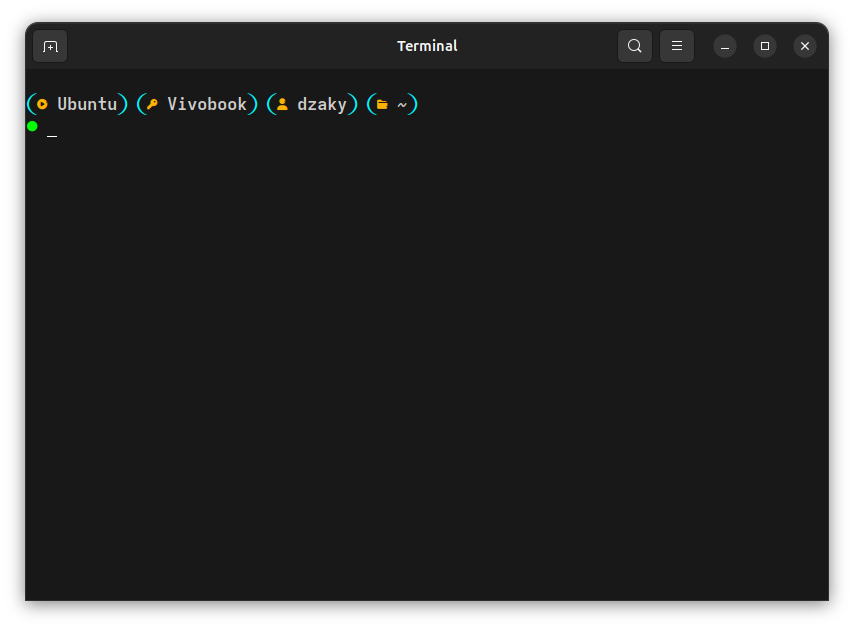

# Zaky's Custom Starship Prompt

A visually enhanced and emoji-powered [Starship](https://starship.rs) prompt configuration file for Linux terminal, this preset blends productivity with aesthetics using bold icons, custom colors, and clear prompts.

## Features

  - Smart Prompt Layout:
  - OS, Hostname, Username
  - Directory (with emoji-based folder names)
  - Command execution time
  - Success/Error indicators
  - Custom Color Palette:
  - Cyan blue highlights
  - Bright green/red prompt symbols
  - Custom text & accent colors
  - Directory Shortcuts:
  - `Documents → 󰈙`, `Downloads → `, `Music → 󰝚`, etc.
  - Optimized for terminal eye-candy AND productivity!

## Requirements

1. A Nerd Font (for icons to appear correctly): Nerd Fonts
2. A terminal that supports true color & emojis (like GNOME Terminal, Alacritty, etc.)

## Preview



> My Terminal emulator used: **GNOME Terminal on Ubuntu 24.04 LTS**
> My Font: *Adwaita Mono Nerd Font*

## Installation

1. Install Starship (if you haven’t):
   ```bash
   curl -sS https://starship.rs/install.sh | sh
   
2. Copy this repo’s starship.toml to your config directory:
   ```bash
   mkdir -p ~/.config
   cp starship.toml ~/.config/
   
3. Add the following to your ~/.bashrc, ~/.zshrc, or shell config:
   ```bash
   eval "$(starship init zsh)"  # or bash/fish/etc.

4. Restart your terminal.


